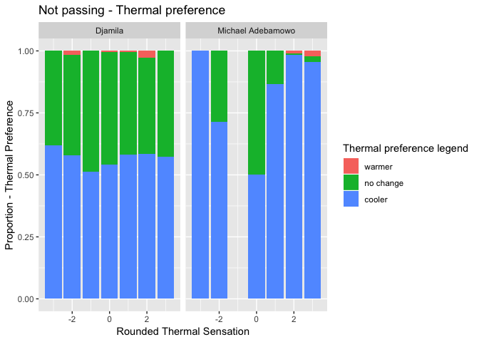
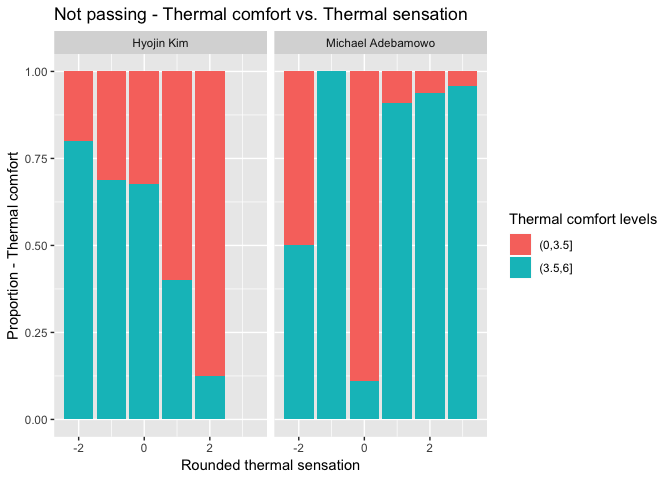
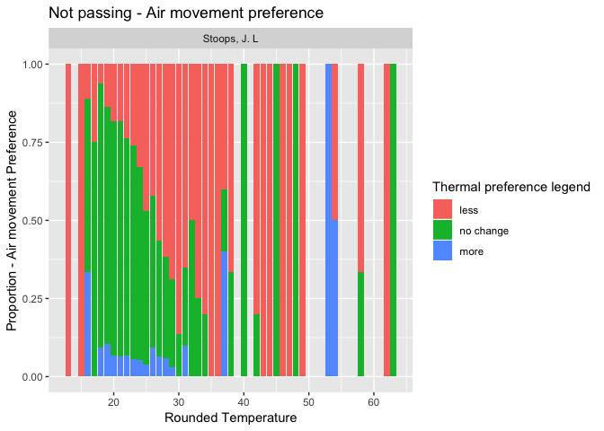
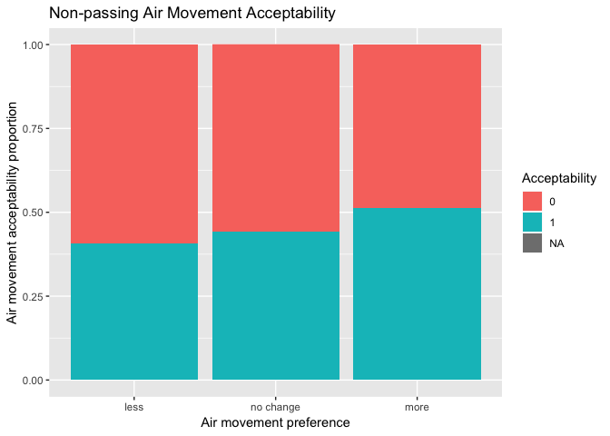

### Overview: 

Review of studies not passing reasonability tests. 

## Thermal 

### Thermal sensation: 

There are 49 applicable studies. All pass. 

### Thermal acceptibility

There are 30 applicable studies. All pass. 

### Thermal preference 

There are 44 applicable studies. Of those, 2 do not pass: 

- Djamila, H., Chu, C. M., & Kumaresan, S. (2013). Field study of thermal comfort in residential buildings in the equatorial hot-humid climate of Malaysia. Building and Environment, 62, 133-142.

- Akande, O. K., & Adebamowo, M. A. (2010, April). Indoor thermal comfort for residential buildings in hot-dry climate of Nigeria. In Proceedings of Conference: Adapting to Change: New Thinking on Comfort, Cumberland Lodge, Windsor, UK (Vol. 911, p. 133144).

<!-- -->

### Thermal Comfort

There are 27 applicable studies. Of those, 2 do not pass. 

- Kim, H. 2012. Methodology for rating a building's overall performance based on the ASHRAE/CIBSE/USGBC Performance Measurement Protocols for Commercial Buildings. Ph.D. dissertation, Department of Architecture, Texas A&M University.

- Akande, O. K., & Adebamowo, M. A. (2010, April). Indoor thermal comfort for residential buildings in hot-dry climate of Nigeria. In Proceedings of Conference: Adapting to Change: New Thinking on Comfort, Cumberland Lodge, Windsor, UK (Vol. 911, p. 133144).

<!-- -->

## Air movement

### Air movement preference 

There are 23 studies and 1 does not pass. 

- Stoops, J. L."The thermal environmentand occupant perceptions in European office buildings". Doctoral thesis. Chalmers University of Technology, 2000. ISBN: 993-356207-x. 

<!-- -->

### Air movement acceptibility reasonability 

11 applicable studies. 1 Study does not pass. 

- Gail Brager, Gwelen Paliaga, Richard de Dear. Operable windows, personal control and occupant comfort. ASHRAE Transactions. 110(2) 

<!-- -->

## Humidity

### Humidity Sensation

9 applicable studies. All pass.

### Humidity preference

7 applicable studies. All pass. 

