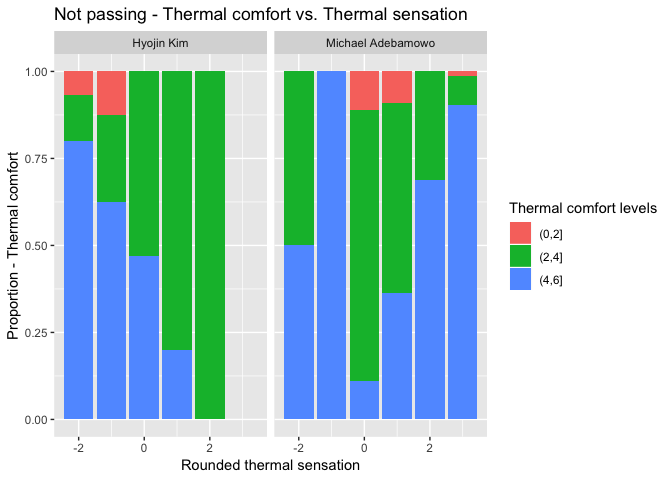

### Overview: 

Review of current thermal, air movmement and humidity reasonability tests. 

## Thermal 


```r
# We want to split the data frame into 39 different data frames based on contributor. 
names <- unique(df$`Data contributor`)
```


```r
for (i in 1:39){
  df_split <- df[which(df$`Data contributor` == names[i]),]
  label <- paste("name", as.character(i), sep = "")
  assign(label, df_split)
}
```


### Thermal sensation: 

Look at example study with Paliaga. This is averaging sensations voted at each temperature recorded. We can use a linear model to see if slope is positive as expected for the studies. 


```r
avgtemp <- name3 %>% group_by(`Air temperature (°F)`) %>% 
  summarise(averagetemp = mean(`Thermal sensation`)) %>% 
  as.data.frame

#avgtemp <- as.data.frame(avgtemp)

ggplot(avgtemp, aes(x =`Air temperature (°F)`, y = averagetemp)) + geom_point() + 
  ylab("Thermal sensation") + ggtitle("Thermal sensation vs. Temperature")
```

<!-- -->

We are able to see below that slow is positive as expected. 


```r
fit <- lm(averagetemp~`Air temperature (°F)`, data = avgtemp )
summary(fit)
```

```
## 
## Call:
## lm(formula = averagetemp ~ `Air temperature (°F)`, data = avgtemp)
## 
## Residuals:
##      Min       1Q   Median       3Q      Max 
## -2.23151 -0.28214 -0.04401  0.26731  2.02152 
## 
## Coefficients:
##                          Estimate Std. Error t value Pr(>|t|)    
## (Intercept)            -10.250378   0.602738  -17.01   <2e-16 ***
## `Air temperature (°F)`   0.143305   0.007995   17.92   <2e-16 ***
## ---
## Signif. codes:  0 '***' 0.001 '**' 0.01 '*' 0.05 '.' 0.1 ' ' 1
## 
## Residual standard error: 0.5785 on 118 degrees of freedom
##   (2 observations deleted due to missingness)
## Multiple R-squared:  0.7314,	Adjusted R-squared:  0.7291 
## F-statistic: 321.3 on 1 and 118 DF,  p-value: < 2.2e-16
```


There are very few groups, but some with only a few temperature points. 


```r
temp_num <- df %>% 
  group_by(`Data contributor`) %>%
  filter(!(is.na(`Air temperature (°F)`))) %>%
  summarise(num = n_distinct(`Air temperature (°F)`)) %>%
  arrange(num)
temp_num
```

```
## # A tibble: 38 x 2
##    `Data contributor`    num
##    <chr>               <int>
##  1 Kazuyo Tsuzuki          1
##  2 Kwok Alison             3
##  3 Pustayova, Hana         4
##  4 "Tham K. W. "           7
##  5 Michael Adebamowo      21
##  6 Hyojin Kim             40
##  7 Shin-ichi Tanabe       40
##  8 Cornelia Moosmann      51
##  9 Chungyoon Chun         57
## 10 Pedersen and Toftum    64
## # ... with 28 more rows
```

For example for Alison Kwok: 


```r
avgtemp <- name1 %>% group_by(`Air temperature (°F)`) %>% 
  summarise(averagetemp = mean(`Thermal sensation`))

avgtemp <- as.data.frame(avgtemp)

ggplot(avgtemp, aes(x =`Air temperature (°F)`, y = averagetemp)) + geom_point() + 
  ylab("Thermal sensation")
```

<!-- -->

```r
fit <- lm(averagetemp~`Air temperature (°F)`, data = avgtemp )
summary(fit)
```

```
## 
## Call:
## lm(formula = averagetemp ~ `Air temperature (°F)`, data = avgtemp)
## 
## Residuals:
##        1        2        3 
##  0.21487 -0.26749  0.05262 
## 
## Coefficients:
##                        Estimate Std. Error t value Pr(>|t|)
## (Intercept)            -5.23960    5.83908  -0.897    0.534
## `Air temperature (°F)`  0.06059    0.07595   0.798    0.571
## 
## Residual standard error: 0.3471 on 1 degrees of freedom
## Multiple R-squared:  0.3889,	Adjusted R-squared:  -0.2222 
## F-statistic: 0.6364 on 1 and 1 DF,  p-value: 0.5713
```

##### Studies with little points: 
Although the slope is still positive, lack of points makes this method a bit unreliable. Hopefully, there are not many studies with very few temperature points. For example, for Kazuyo Tsuzuki's study, it is impossible to fit a linear model. In this case, we can only do a rough check that data is in expected format. There are 26 applicable studies for checking. All pass. 

### Thermal acceptibility


```r
ggplot(name3, aes(x =`Air temperature (°F)`)) + geom_bar(aes(fill = factor(`Thermal sensation acceptability`)))
```

<!-- -->


```r
ggplot(name3, aes(x =`Thermal sensation`)) + geom_bar(aes(fill = factor(`Thermal sensation acceptability`))) + 
  scale_fill_discrete("Key - Thermal acceptability")
```

<!-- -->


For thermal acceptability, I am thinking of looking at the number of people who vote acceptable for every sensation or temperature. If the trend is such as above where it is like a negative quadratic, it will pass the reasonability test. Since for quadratic function, we will need more temperature points than a linear function, perhaps can make function so that if the number of unique temperatures is less than the unique thermal sensation votes, then we will use thermal sensation votes instead. 

Current function tests against thermal sensation. There are 20 applicable studies for checking. All pass. 


### Thermal preference 

For this test, we take the thermal sensation and thermal preference data and do a rough check just to see if proportion of people wanting warmer as thermal sensation goes up decreases while proportion of people wanting cooler as thermal sensation goes down. 

Out of 39 studies, 28 studies were applicable and 4 did not pass this reasonability test. They were Djamila, Sanyogita Manu and Michael Adebamowo's studies. 

Djamila, Sanyogita Manu and Michael Adebamowo's were studies found to be questionable in the first powerpoint. 


```r
not_pass <- rbind(name14, name31, name34)
not_pass1 <- subset(not_pass, !(is.na(`Thermal preference`)))

ggplot(not_pass1, aes(x = round(`Thermal sensation`), y = rep(1, times = nrow(not_pass1)))) + 
  geom_bar(aes(fill = factor(`Thermal preference`, levels = c("warmer", "no change", "cooler"))), position = "fill", stat = "identity") + 
  facet_grid(~`Data contributor`) + 
  xlab("Rounded Thermal Sensation") + 
  ylab("Proportion - Thermal Preference") + 
  scale_fill_discrete(name = "Thermal preference legend") + 
  ggtitle("Not passing - Thermal preference")
```

<!-- -->


```r
sensation <- name30$`Thermal sensation`[which(!is.na(name30$`Thermal preference`))]
pref <- factor(name30$`Thermal preference`[which(!is.na(name30$`Thermal preference`))], levels = c("warmer", "no change", "cooler"))
                                                                                                  

new <- data.frame(sensation, pref)

ggplot(new, aes(x=sensation, y = rep(1, times = nrow(new)))) + geom_bar(aes(fill = factor(pref)), position = "fill", stat = 'identity', na.rm = TRUE) + scale_fill_manual(values=c("indianred1", "palegreen3", "deepskyblue")) + 
  xlab("Thermal sensation") + 
  ylab("Proportion - Thermal Preference") + 
  scale_fill_discrete(name = "Thermal Preference Key") + 
  ggtitle("Example of expected thermal preference")
```

<!-- -->

### Thermal Comfort

For this reasonability test, we take the average comfort level reported at each thermal sensation level and check if the output resembles a quadratic function with a negative coefficient in the second degree. 


```r
test <- name9
ggplot(test, aes(x = round(`Thermal sensation`), y = rep(1, times = nrow(test)))) + 
  #geom_point()
  geom_bar(aes(fill =  factor(cut(as.numeric(`Thermal comfort`), breaks = c(0,2, 4, 6)))), position = "fill", stat = 'identity') + 
  xlab("Thermal sensation") + 
  ylab("Proportion Thermal comfort") + 
  scale_fill_discrete(name = "Key Thermal Comfort") + 
  ggtitle("Example of expected: Thermal comfort vs. Thermal sensation")
```

<!-- -->

This is an example of a very good one. Others look a bit more messier. If we average over each thermal sensation: 


```r
sum_test <- test %>% group_by(round(`Thermal sensation`)) %>%
  summarise(avg = mean(as.numeric(`Thermal comfort`), na.rm = TRUE))

names(sum_test) <- c("Temperature", "comfort")

ggplot(sum_test, aes(x = Temperature, y = comfort)) + geom_point() + 
  xlab("Thermal sensation") + 
  ylab("Average thermal comfort") + 
  ggtitle("Expected average thermal comfort")
```

<!-- -->

So we look for this shape. 

Doing so, we get a 17 studies with enough thermal sensation or  thermal comfort information. Out of these 2 fail: 
 - Hyojin Kim 
 - Michael Abedamowo 
 
Plot the three studies below: 


```r
df_new <- rbind(name2, name34)
```


```r
ggplot(subset(df_new, !is.na(`Thermal comfort`)), aes(x = round(`Thermal sensation`), y = rep(1, times = nrow(subset(df_new, !is.na(`Thermal comfort`)))))) + 
  geom_bar(aes(fill =  factor(cut(as.numeric(`Thermal comfort`, na.rm = T), breaks = c(0,2, 4, 6), na.rm = T))), position = "fill", stat = 'identity', na.rm = TRUE)  + 
  facet_grid(~`Data contributor`) + 
  scale_fill_discrete(name = "Thermal comfort levels") + 
  xlab("Rounded thermal sensation") + 
  ylab("Proportion - Thermal comfort") + 
  ggtitle("Not passing - Thermal comfort vs. Thermal sensation")
```

<!-- -->


```r
sum_new <- df_new %>% group_by(`Data contributor`, round(`Thermal sensation`)) %>%
  summarise(avg = mean(as.numeric(`Thermal comfort`), na.rm = TRUE))

names(sum_new) <- c("Data contributor", "Temperature", "comfort")

ggplot(sum_new, aes(x = Temperature, y = comfort)) + geom_point() + facet_grid(~`Data contributor`)  
```

<!-- -->

These look a bit different as expected. 


## Air movement

Although few, there are a few contributors with very few velocity points. Then, it becomes hard to fit a linear model to their data points. 


```r
velocities <- df %>% 
  group_by(`Data contributor`) %>%
  filter(!is.na(`Air velocity (m/s)`)) %>%
  summarise(num = n_distinct(`Air velocity (m/s)`)) %>%
  arrange(num)
velocities <- as.data.frame(velocities)
```


```r
velocities[1:12,]
```

```
##     Data contributor num
## 1        Singh Manoj   2
## 2        Kwok Alison   3
## 3   Marcel Schweiker   6
## 4         Lynda Webb   7
## 5        Tham K. W.    7
## 6  Michael Adebamowo   8
## 7      Despoina Teli  14
## 8   Renata De Vecchi  14
## 9        Langevin J.  16
## 10           Djamila  17
## 11        Hyojin Kim  28
## 12      Zhaojun Wang  29
```

Out of the first 6, I checked if people voted for air movement preference or acceptibility. Following people had data on preference and acceptibility.

##### Preference: 

- Kwok Alison 
- Lynda Webb 
- Michael Adebamowo 

##### Acceptibility: 

- Kwok Alison 
- Lynda Webb (Here all values of acceptibility did not correspond to a non-NA wind velocity.)


### Air movement preference reasonability 

Note: tried to compare air movement preference with velocity and found that people seemed to want more air movement as velocity increased. (Counterintuitive?)

We can map: 

- less movement --> -1 
- no change --> 0 
- more movement --> 1

Take the average preference at every temperature and confirm if people want more air movement as temperature increases. 

If the number of unique temperatures is not greater than 6, we can take the thermal sensation votes. 

Example of expected: 


```r
test2 <- name22
num_pref <- factor(test2$`Air movement preference`, levels = c("less", "no change", "more"), labels = c(-1, 0, 1))
```


```r
test2_rev <- data.frame(as.numeric(as.character(num_pref)), test2$`Air velocity (m/s)`, test2$`Air temperature (°F)`)
names(test2_rev) <- c("num_pref", "velocity", "temperature")

sums <- test2_rev %>% group_by(temperature) %>%
  summarise(mean = mean(num_pref, na.rm = T))
```


```r
sums %>% ggplot(aes(x=temperature, y = mean)) + geom_point() + geom_smooth(method = 'lm') + 
  ylab("Mean Air Movement Preference") + 
  xlab("Air temperature (F)") + 
  ggtitle("Example expected air movement preference vs. temperature")
```

<!-- -->

```r
ggsave("ppt8.png")
```

```
## Saving 7 x 5 in image
```


Out of 18 applicable studies, 1 did not pass: Stoops, J. L (Index 20all). 

Let's take a look at Stoops' study: 


```r
test2 <- name20
num_pref <- factor(test2$`Air movement preference`, levels = c("less", "no change", "more"), labels = c(-1, 0, 1))
```


```r
test2_rev <- data.frame(as.numeric(as.character(num_pref)), test2$`Air velocity (m/s)`, test2$`Air temperature (°F)`)
names(test2_rev) <- c("num_pref", "velocity", "temperature")

sums <- test2_rev %>% group_by(temperature) %>%
  summarise(mean = mean(num_pref, na.rm = T))
```


```r
sums %>% ggplot(aes(x=temperature, y = mean)) + geom_point() + geom_smooth(method = 'lm') + 
  xlab("Air Temperature (F)") +
  ylab("Mean Air Preference") +
  ggtitle("Not passing: Air preference vs. Temperature") 
```

<!-- -->


### Air movement acceptibility reasonability 

Here, we check against the air movement preference. We expect that if people want less or more air, then less people would find that air speed acceptable. 
The keypoint here is that the highest proportion of people find an air speed acceptable if people would want "no change" in an air speed. So we can quickly check this in each group. 

With this, out of 8 applicable studies, we get 7 passing with Paliaga's study not passing. 

We expect something like: 


```r
ggplot(name1, aes(x = factor(`Air movement preference`, levels = c("less", "no change", "more")), y = rep(1, times = nrow(name1)))) + 
  geom_bar(aes(fill = factor(round((`Air movement acceptability`)))), stat = 'identity', position = 'fill') + 
  xlab("Air movement preference") + 
  ylab("Air movement acceptability proportion") + 
  scale_fill_discrete(name = "Acceptability") + 
  ggtitle("Expected Air Movement Acceptability") 
```

<!-- -->


```r
sub_n3 <- subset(name3, !(is.na(`Air movement preference`)))
ggplot(sub_n3, aes(x = factor(`Air movement preference`, levels = c("less", "no change", "more")), y = rep(1, times = nrow(sub_n3)))) + 
  geom_bar(aes(fill = factor(round((`Air movement acceptability`)))), stat = 'identity', position = 'fill') + 
  xlab("Air movement preference") + 
  ylab("Air movement acceptability proportion") + 
  scale_fill_discrete(name = "Acceptability") + 
  ggtitle("Non-passing Air Movement Acceptability")
```

<!-- -->


##Humidity


A note on how many unique humidity readings there were for each study. The first study listed will not be able to be used for any reasonbility test. 


```r
humidity <- df %>% 
  group_by(`Data contributor`) %>%
  filter(!is.na(`Relative humidity (%)`)) %>% 
  summarise(num = n_distinct(`Relative humidity (%)`)) %>%
  arrange(num)
```


```r
humidity
```

```
## # A tibble: 34 x 2
##    `Data contributor`    num
##    <chr>               <int>
##  1 Kazuyo Tsuzuki          1
##  2 Kwok Alison             3
##  3 "Tham K. W. "           7
##  4 Indraganti Madhavi     54
##  5 Shin-ichi Tanabe       56
##  6 Hyojin Kim             63
##  7 Michael Adebamowo      68
##  8 Pedersen and Toftum    73
##  9 Ramona Romero          73
## 10 Despoina Teli          96
## # ... with 24 more rows
```

### Humidity Sensation

For this, we check the humidity sensation against the reported relative humidity levels. We take the average reported humidity sensation at each relative humidity level and see if the slope is negative as expected. For this, there were 8 applicable studies and all tests passed. 

Expected: 


```r
avg_sensation <- name33 %>% 
  mutate(rounded_humidity = round(`Relative humidity (%)`)) %>%
  group_by(rounded_humidity) %>%
  filter(!is.na(`Humidity sensation`)) %>% 
  summarise(sensation = mean(`Humidity sensation`))
avg_sensation
```

```
## # A tibble: 37 x 2
##    rounded_humidity sensation
##               <dbl>     <dbl>
##  1               39     0.75 
##  2               40     1    
##  3               42     0.5  
##  4               44     1    
##  5               45     1    
##  6               46     0.929
##  7               47     2    
##  8               48     0.684
##  9               49     1.5  
## 10               50     0.647
## # ... with 27 more rows
```


```r
ggplot(avg_sensation, aes(x= rounded_humidity, y = sensation )) + geom_point() + 
  geom_smooth(method = 'lm') + 
  xlab("Rounded humidity") + 
  ylab("Humidity sensation") + 
  ggtitle("Expected humidity sensation vs. humidity")
```

<!-- -->

### Humidity preference

We treat this in the same as with temperature preference and compare each humidity preference with the humidity sensation. We do a quick check to see if proportion of people wanting drier goes down as humidity sensation goes up, and check the opposite for people who want more humid. 

There seem to be 6 applicable studies. And out of these 6, all pass. 


```r
sub_n34 <- subset(name34, !(is.na(`Humidity preference`)))
ggplot(sub_n34, aes(x = `Humidity sensation`, y = rep(1, times = nrow(sub_n34)))) + 
  geom_bar(aes(fill = factor(`Humidity preference`, levels = c("drier", "no change", "more humid"))), stat = 'identity', position = 'fill') + 
  xlab("Humidity sensation") + 
  ylab("Humidity preference proportion") + 
  scale_fill_discrete(name = "Preference") + 
  ggtitle("Example Humidity Sensation")
```

<!-- -->


